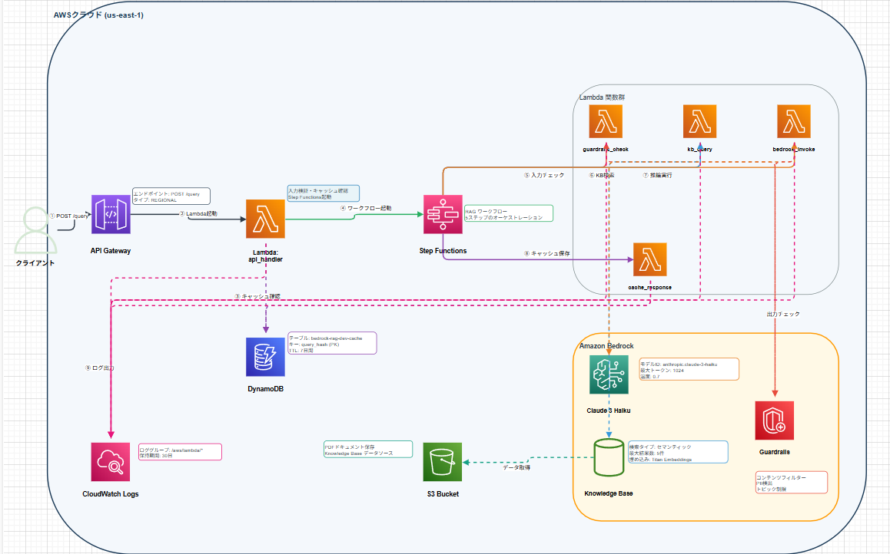

# Bedrock RAG PoC ― Amazon Bedrock / Knowledge Base / Guardrails を統合したサーバーレスRAGパターン検証

## 🚀 エグゼクティブサマリー

本PoCでは、Amazon Bedrock（Claude 3 Haiku）/ Knowledge Base（以降KB）/ Guardrails / Step Functions を組み合わせたサーバーレスRAG APIを Terraform で構築し、実運用で必要になりやすい設計要素（安全性チェック、ワークフロー分離、キャッシュ、可観測性、IaC）を最小構成で実装・検証しました。
Step Functionsによるワークフロー制御、入出力Guardrailsによる安全性検証、DynamoDBキャッシュによるコスト最適化を組み合わせることで、同様の構成を他のRAG APIにも適用可能な、再現性の高い基盤パターンとして整理しています。

| 観点 | 実装内容 |
| :--- | :--- |
| **サーバーレスRAG基盤** | API Gateway → Lambda → Step Functions → 複数Lambda（Guardrails / KB / Bedrock / Cache）で構成。Step Functionsで各処理を逐次実行し、API経由でレスポンスを返却。 |
| **責任あるAI** | Guardrailsを入出力両方に適用し、有害コンテンツや規約違反をブロック。専用エラーハンドリングで 4xx（例: 400）を返却し、レスポンスの `error_code=guardrails_blocked` を標準化。 |
| **コスト最適化と高速化** | Claude 3 Haiku + DynamoDBキャッシュ（クエリハッシュキー、TTL管理）で重複問い合わせを抑制。ログ保持は30日とし、主な固定費はDynamoDBストレージとログ保持に限定（推論/ワークフロー実行はリクエスト時のみ）。 |
| **IaCと再現性** | VPC閉域化（Private化）はスコープ外としつつ、IAMは最小権限で定義。Terraformで Knowledge Base / Guardrails / Step Functions / Lambda / API Gateway をコード化し、`scripts/deploy.sh` で再構築可能。 |

---

## 🎯 PoCの背景と目的

本PoCは、Bedrock RAG基盤における安全性・ワークフロー制御・コスト最適化の実践的なアーキテクチャパターンを検証するために構築しました。モデルチューニングそのものではなく、Step Functionsによる処理フロー管理、Guardrailsによる入出力検証、キャッシュ設計といった本番要件で求められやすい基盤エンジニアリングの観点にフォーカスしています。

---

## 🛠 システム概要

API Gateway で受けた `POST /query` を Lambda (api_handler) が検証・キャッシュ確認した後、Step Functions が Guardrails → Knowledge Base → Bedrock → Guardrails → DynamoDB キャッシュ反映を順次実行します。全Lambda関数でCloudWatch Logsへの構造化ログ出力を実装しています。

### **主要エンドポイント**

1. **POST /query** - 技術文書に基づく回答生成エンドポイント
   - `{"query": "<text>"}` を受け付け、回答テキスト/参照ソース/キャッシュヒット有無/実行時間を返却
   - 入力検証（文字数・禁則文字）と、Guardrailsブロック時のエラーコード（`guardrails_blocked`）を標準化
     - 内部では `GuardrailsBlocked` として扱い、APIレスポンスでは `error_code=guardrails_blocked` を返却


### **アーキテクチャ図**



*Draw.ioファイル: [architecture.drawio](./docs/architecture.drawio)*

### **処理フロー**

```
【ユーザー】
POST /query
│
├─ Lambda: api_handler
│   ├─ 入力バリデーション / CacheService.get
│   └─ Step Functions 実行開始
│
└─ Step Functions Workflow
    ├─ Lambda: guardrails_check (Input)
    │    └─ Bedrock Guardrails API 呼び出し
    ├─ Lambda: kb_query
    │    └─ Knowledge Base から上位チャンク取得
    ├─ Lambda: bedrock_invoke
    │    └─ Claude 3 Haiku へKB結果を渡して回答生成
    ├─ Lambda: guardrails_check (Output)
    └─ Lambda: cache_response
         └─ DynamoDB に回答とソースを保存

【レスポンス】
Step Functions 出力 → Lambda: api_handler → API Gateway
```

---

## ✨ 技術スタックと主要機能

### **インフラ（IaC）**
- **Terraform**: AWSインフラをコードで定義・管理
  - 詳細は **[TERRAFORM_GUIDE.md](./terraform/TERRAFORM_GUIDE.md)** を参照
- **Shell Scripts**: `scripts/validate.sh` で事前チェック、`scripts/destroy.sh` で後片付けを自動化。

### **AWSサービス**
- **Amazon Bedrock**: Claude 3 Haiku で回答生成、Guardrails API で安全性チェック、Knowledge Base で文書検索。
- **AWS Step Functions**: フルマネージドワークフロー。ガードレール検知・リトライ処理・実行結果の伝搬を管理。
- **AWS Lambda / API Gateway**: クエリ受付・ビジネスロジック実装。Lambda Powertoolsで構造化ログを標準化。
- **Amazon DynamoDB**: キャッシュテーブル `bedrock-rag-dev-cache` にクエリ結果を保存し、TTLで自動パージ。
- **Amazon CloudWatch Logs**: すべてのLambda関数ログ、Step Functions実行ログを集中管理（保持30日）。

### **アプリケーション**
- **Python 3.11 + Poetry**: Poetryで依存管理（必要に応じて requirements.txt へエクスポート可能）。`src/handlers` / `src/services` / `src/models` / `src/utils` に責務分離。
- **Pydantic**: `QueryRequest` / `QueryResponse` モデルで型安全なI/Oを定義。
- **AWS Lambda Powertools**: loggerで構造化ログを標準化（必要に応じて metrics/tracing へ拡張可能）。
- **Validation & Error Handling**: `src/utils/validators.py` と `error_handler.py` で共通化し、APIレスポンスを一貫化。

詳細なアーキテクチャと設計仕様は **[設計書.md](./docs/設計書.md)** を参照してください。

---

## 💡 実装時の技術課題と解決策

### **1. Step Functions と Bedrock の統合パターン選択**
- **課題**: Step FunctionsからBedrockを直接呼び出すAWS SDK統合と、Lambda経由で呼び出すパターンが存在する。
- **解決策**: RAGではKB検索結果から複雑なプロンプト構築が必要なため、柔軟な処理が可能なLambda統合を採用。開発効率と柔軟性を優先し、コスト差は相対的に小さい前提で許容しました（価格はモデル/リージョン/トークン量で変動）。

### **2. Guardrails の入出力チェック設計**
- **課題**: 入力チェック失敗時と出力チェック失敗時で処理フローが異なる。
- **解決策**: 入力チェック失敗は即座に`GuardrailsBlocked`エラーを返し、出力チェック失敗は再生成をリトライ（最大3回）。Step Functionsの`Catch`ブロックで専用ハンドラに転送し、`check_type`パラメータでコードを再利用しています。

### **3. KBの検索精度とコンテキスト量の調整**
- **課題**: KBから取得するチャンク数が多すぎるとコンテキストウィンドウを圧迫し、少なすぎると回答精度が低下する。
- **解決策**: `numberOfResults=5` に設定し、合計2,500トークン程度（各チャンク約500トークン想定）に抑制。プロンプトテンプレート（`src/config/prompts.py`）で注入し、モデルのコンテキスト上限に対して余裕を確保しました（トークン数は目安）。

### **4. Step Functions のエラーハンドリングとリトライロジック**
- **課題**: Bedrock APIやKBは一時的な障害の可能性があり、リトライ設計が必要。
- **解決策**: 各Lambdaタスクに指数バックオフで最大3回リトライする設定を追加。`GuardrailsBlocked`はリトライ対象外とし、`Catch`ブロックで専用ハンドラに転送して明確なエラーを返却します。

---

## 📚 セットアップ手順

プロジェクトの初回セットアップから動作確認まで、詳細な手順は以下のドキュメントを参照してください：

### 📖 [SETUP_GUIDE.md](./docs/SETUP_GUIDE.md)

---

### 🔍 プロジェクト構造

プロジェクトの詳細なディレクトリ構造については、[docs/DIRECTORY_STRUCTURE.md](./docs/DIRECTORY_STRUCTURE.md) を参照してください。

---

## 📝 本番環境で追加すべき要素

本PoCでは、サーバーレスRAG API 基盤の中核となる部分にフォーカスしており、以下の機能はスコープ外としています。本番環境では要件に応じて、これらを追加実装する想定です。

- **CI/CD パイプライン**: GitHub Actionsで`terraform plan/apply`、Lambdaビルド、APIテストを自動化
- **認証・認可**: CognitoまたはJWTでユーザー認証を実装し、API Gatewayのオーソライザーでトークン検証
- **監視・アラート**: CloudWatch DashboardでAPI呼び出し数・エラー率・レイテンシを可視化し、閾値超過時にSNS通知
- **ログ保管とコンプライアンス**: CloudWatch Logsの保持期間延長（30日→1年以上）とS3エクスポートで長期アーカイブ
- **ドキュメント管理パイプライン**: KBのデータソース同期（取り込み）をCI/CDで自動化し、S3上のPDF更新を契機に反映。バージョニング/メタデータ管理で検索精度を向上
- **レート制限/悪用対策**: API Gateway Usage Plan または AWS WAF によるレート制限・Bot対策を追加し、濫用アクセスを防止
- **暗号化/KMS**: DynamoDB/S3/ログの暗号化方針を定義し、KMSキーの管理（分離・ローテーション）を追加
