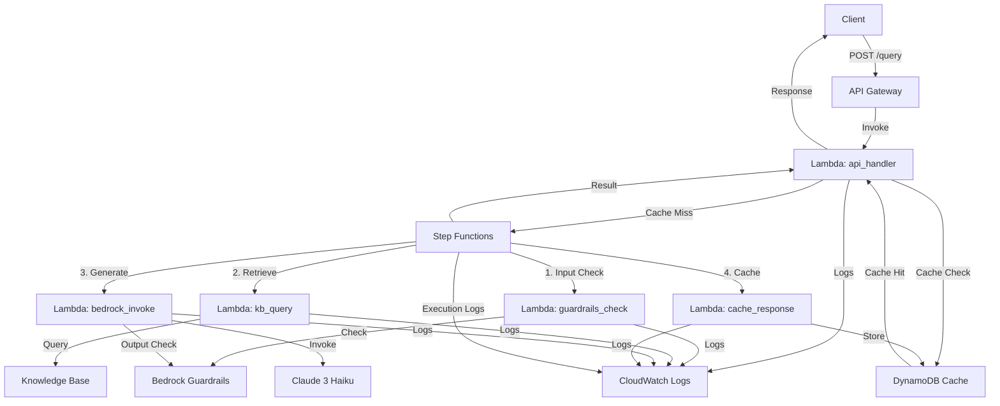

# 設計ドキュメント（日本語版）

## 概要

本ドキュメントは、Amazon Bedrock（Claude 3 Haiku）・Knowledge Base・Guardrails・Step Functions を組み合わせたサーバーレス RAG（Retrieval-Augmented Generation）API のシステム設計を説明する。API Gateway で受け付けたクエリを Lambda で処理し、Step Functions がワークフローをオーケストレーションすることで、Knowledge Base 検索、Bedrock 推論、Guardrails 検査、DynamoDB キャッシュを統合した信頼性の高い RAG 基盤を構築している。

## アーキテクチャ

### ハイレベル構成

```
ユーザー
    ↓
API Gateway (POST /query)
    ↓
Lambda: api_handler (入力検証・キャッシュ確認)
    ↓
Step Functions Workflow
    ├─ Lambda: guardrails_check (入力)
    ├─ Lambda: kb_query
    ├─ Lambda: bedrock_invoke (推論 + 出力Guardrails)
    └─ Lambda: cache_response
    ↓
DynamoDB (キャッシュ)
    ↓
CloudWatch Logs
```

### ネットワーク構成

本PoCはサーバーレス構成のため、VPC は不使用。すべてのコンポーネントは AWS マネージドサービスで構成され、パブリックエンドポイントを使用。

```
Internet
    ↓
API Gateway (REGIONAL)
    ↓
Lambda Functions (パブリックサブネット相当のマネージド環境)
    ├─ api_handler
    ├─ guardrails_check
    ├─ kb_query
    ├─ bedrock_invoke
    └─ cache_response
    ↓
AWS マネージドサービス
    ├─ Step Functions
    ├─ DynamoDB
    ├─ Amazon Bedrock
    │   ├─ Claude 3 Haiku
    │   ├─ Knowledge Base
    │   └─ Guardrails
    └─ CloudWatch Logs
```

### コンポーネント図



## コンポーネントとインターフェース

### 1. API Gateway

**責務**
- HTTP エンドポイント `POST /query` を提供
- リクエストを Lambda (api_handler) にルーティング
- CORS 設定で OPTIONS メソッドをサポート

**エンドポイント**

```
POST /query
Request:
{
  "query": "string (1-1000文字)"
}

Response (成功):
{
  "answer": "string",
  "sources": [
    {
      "content": "string",
      "metadata": {
        "location": {"s3Location": {"uri": "s3://..."}},
        "score": float
      }
    }
  ],
  "cached": boolean,
  "request_id": "string",
  "processing_time_ms": float
}

Response (Guardrails ブロック):
{
  "error": "guardrails_blocked",
  "message": "Your query was blocked by content policy",
  "request_id": "string"
}

Response (エラー):
{
  "error": "error_type",
  "message": "string",
  "request_id": "string"
}
```

### 2. Lambda 関数群

#### 2.1 api_handler

**責務**
- リクエストの入力検証（文字数・禁則文字チェック）
- DynamoDB キャッシュの確認とヒット時の即時返却
- Step Functions ワークフローの起動と結果待機
- レスポンス整形とエラーハンドリング

**環境変数**
- `STATE_MACHINE_ARN`: Step Functions ステートマシンの ARN
- `CACHE_TABLE_NAME`: DynamoDB テーブル名
- `MAX_QUERY_LENGTH`: クエリ最大文字数（デフォルト: 1000）
- `POWERTOOLS_SERVICE_NAME`: ログサービス名

**処理フロー**
1. リクエストボディのパース
2. クエリテキストのバリデーション
3. クエリハッシュ生成とキャッシュ確認
4. キャッシュヒット → 即時返却
5. キャッシュミス → Step Functions 起動
6. 実行完了待機（最大5分）
7. レスポンス返却

#### 2.2 guardrails_check

**責務**
- Bedrock Guardrails API でコンテンツポリシー違反を検査
- 入力・出力の両方に対応（check_type パラメータで切替）
- ブロック時は GuardrailsError 例外を送出

**環境変数**
- `GUARDRAILS_ID`: Guardrails 識別子
- `GUARDRAILS_VERSION`: バージョン（デフォルト: DRAFT）

**入力**
```json
{
  "query": "string",
  "check_type": "input" | "output",
  "request_id": "string"
}
```

**出力**
```json
{
  "query": "string",
  "request_id": "string",
  "guardrails_passed": true,
  "guardrails_action": "GUARDRAILS_INTERVENED" | "NONE"
}
```

#### 2.3 kb_query

**責務**
- Amazon Knowledge Base にセマンティック検索クエリを送信
- 上位 N 件（デフォルト: 5件）のドキュメントチャンクを取得
- 検索結果をコンテキストテキストとして整形

**環境変数**
- `KNOWLEDGE_BASE_ID`: Knowledge Base 識別子
- `KB_MAX_RESULTS`: 最大取得件数（デフォルト: 5）

**入力**
```json
{
  "query": "string",
  "request_id": "string"
}
```

**出力**
```json
{
  "query": "string",
  "request_id": "string",
  "context": "string (結合されたチャンクテキスト)",
  "kb_results": [
    {
      "content": "string",
      "score": float,
      "location": {"s3Location": {"uri": "string"}}
    }
  ],
  "kb_results_count": int
}
```

#### 2.4 bedrock_invoke

**責務**
- Knowledge Base 検索結果を元にプロンプトを構築
- Claude 3 Haiku モデルで回答を生成
- 生成結果に対して出力 Guardrails チェックを実行
- トークン使用量とレイテンシをログ出力

**環境変数**
- `MODEL_ID`: Bedrock モデル ID（例: anthropic.claude-3-haiku-20240307-v1:0）
- `MAX_TOKENS`: 最大生成トークン数（デフォルト: 1024）
- `TEMPERATURE`: サンプリング温度（デフォルト: 0.7）

**入力**
```json
{
  "query": "string",
  "context": "string",
  "kb_results": [...],
  "request_id": "string"
}
```

**出力**
```json
{
  "query": "string",
  "context": "string",
  "kb_results": [...],
  "answer": "string",
  "request_id": "string",
  "model_response": {
    "usage": {
      "input_tokens": int,
      "output_tokens": int
    }
  }
}
```

#### 2.5 cache_response

**責務**
- クエリハッシュをパーティションキーとして DynamoDB に保存
- TTL（7日間）を設定して自動削除
- キャッシュ保存の成否をログ出力

**環境変数**
- `CACHE_TABLE_NAME`: DynamoDB テーブル名
- `CACHE_TTL_DAYS`: TTL日数（デフォルト: 7）

**入力**
```json
{
  "query": "string",
  "answer": "string",
  "kb_results": [...],
  "request_id": "string"
}
```

### 3. Step Functions ワークフロー

**ステートマシン名**: `bedrock-rag-dev-rag-workflow`

**ワークフロー定義**

```
StartAt: GuardrailsCheck
States:
  1. GuardrailsCheck (Lambda Task)
     - 入力コンテンツポリシー違反チェック
     - Retry: Lambda エラー時 最大3回（指数バックオフ）
     - Catch: GuardrailsError → GuardrailsBlocked
     - Next: KnowledgeBaseQuery

  2. KnowledgeBaseQuery (Lambda Task)
     - Knowledge Base 検索
     - Retry: Lambda エラー時 最大3回
     - Catch: 検索失敗時 → UseEmptyContext
     - Next: BedrockInvoke

  3. UseEmptyContext (Pass State)
     - KB 検索失敗時に空のコンテキストを設定
     - Next: BedrockInvoke

  4. BedrockInvoke (Lambda Task)
     - Bedrock 推論実行 + 出力 Guardrails チェック
     - Retry: Lambda エラー時 最大3回
     - Catch: GuardrailsError → GuardrailsBlocked
     - Next: CacheResponse

  5. CacheResponse (Lambda Task)
     - DynamoDB にキャッシュ保存
     - Retry: Lambda エラー時 最大3回
     - Next: Success

  6. Success (Succeed State)
     - 正常終了

  7. GuardrailsBlocked (Fail State)
     - Guardrails ブロック時の終了状態
     - Error: GuardrailsBlocked
     - Cause: Content policy violation

  8. HandleError (Fail State)
     - その他のエラー時の終了状態
```

**リトライ設定**
- ErrorEquals: Lambda.ServiceException, Lambda.AWSLambdaException, Lambda.SdkClientException
- IntervalSeconds: 2
- MaxAttempts: 3
- BackoffRate: 2.0

### 4. DynamoDB テーブル

**テーブル名**: `bedrock-rag-dev-cache`

**キー設計**
- パーティションキー: `query_hash` (String) - クエリテキストの SHA256 ハッシュ
- ソートキー: なし

**属性**
- `query_hash`: クエリハッシュ（PK）
- `query`: 元のクエリテキスト
- `answer`: 生成された回答
- `sources`: Knowledge Base 検索結果（JSON）
- `created_at`: キャッシュ作成日時（ISO8601）
- `ttl`: TTL エポックタイム（7日後）

**プロビジョニング**
- Billing Mode: PAY_PER_REQUEST（オンデマンド）
- TTL: `ttl` 属性で自動削除

### 5. Amazon Bedrock コンポーネント

#### 5.1 Claude 3 Haiku モデル

- モデル ID: `anthropic.claude-3-haiku-20240307-v1:0`
- コンテキストウィンドウ: 200K トークン
- 最大出力: 4096 トークン（設定値: 1024）
- 料金: 入力 $0.00025/1K トークン、出力 $0.00125/1K トークン

#### 5.2 Knowledge Base

- 埋め込みモデル: Titan Embeddings G1 - Text
- ベクトルストア: Amazon OpenSearch Serverless
- チャンキング戦略: デフォルト（固定サイズ）
- データソース: Amazon S3 バケット（PDF ドキュメント）
- 検索設定: セマンティック検索、上位5件取得

#### 5.3 Guardrails

- バージョン: DRAFT
- コンテンツフィルター:
  - 有害コンテンツ（HATE, INSULTS, VIOLENCE など）
  - 個人情報（PII）検出
  - トピック制限（組織固有のポリシー）
- 適用箇所: 入力（ユーザークエリ）・出力（Bedrock 生成結果）

### 6. 監視とログ

**CloudWatch Logs**
- ロググループ: `/aws/lambda/<function-name>`
- 保持期間: 30日
- ログストリーム: Lambda 実行ごとに自動生成
- Step Functions 実行ログ: `/aws/vendedlogs/states/<state-machine-name>`

**構造化ログ（AWS Lambda Powertools）**
- 形式: JSON
- 標準フィールド: timestamp, level, service, request_id, function_name
- カスタムフィールド: query_hash, cache_hit, processing_time_ms, token_usage

**CloudWatch Metrics**
- API Gateway: 呼び出し数、レイテンシ、4xx/5xx エラー率
- Lambda: 実行回数、Duration、エラー数、コールドスタート数
- Step Functions: 実行数、成功/失敗数、実行時間
- DynamoDB: 読み込み/書き込みユニット、スロットリングエラー

### 7. セキュリティ要素

**IAM ロール**

1. **Lambda 実行ロール** (`bedrock-rag-dev-lambda-execution-role`)
   - AWSLambdaBasicExecutionRole（CloudWatch Logs 書き込み）
   - DynamoDB 読み書き権限（`bedrock-rag-dev-cache` テーブル）
   - Bedrock 呼び出し権限（InvokeModel, Retrieve, ApplyGuardrail）
   - Step Functions 起動権限（StartExecution, DescribeExecution）

2. **Step Functions 実行ロール** (`bedrock-rag-dev-sfn-execution-role`)
   - Lambda 関数呼び出し権限（InvokeFunction）
   - CloudWatch Logs 書き込み権限

3. **API Gateway 実行ロール**
   - Lambda 呼び出し権限（api_handler のみ）

**環境変数の暗号化**
- 機密情報（モデル ID、Knowledge Base ID、Guardrails ID）は環境変数で管理
- AWS Systems Manager Parameter Store や Secrets Manager への移行も可能

**アクセス制御**
- API Gateway: 認証なし（本番環境では Cognito/JWT 推奨）
- Lambda: IAM ロールベースのアクセス制御
- DynamoDB: IAM ポリシーで最小権限を付与

## データモデル

### Python Pydantic モデル（想定）

```python
from pydantic import BaseModel, Field
from typing import List, Optional

class QueryRequest(BaseModel):
    query: str = Field(..., min_length=1, max_length=1000)

    class Config:
        json_schema_extra = {
            "example": {"query": "What is Amazon Bedrock?"}
        }

class Source(BaseModel):
    content: str
    score: float
    location: dict

class QueryResponse(BaseModel):
    answer: str
    sources: List[Source]
    cached: bool
    request_id: str
    processing_time_ms: float

class ErrorResponse(BaseModel):
    error: str
    message: str
    request_id: str

class CacheItem(BaseModel):
    query_hash: str
    query: str
    answer: str
    sources: List[Source]
    created_at: str  # ISO8601
    ttl: int  # Epoch time
```

## Terraform ステート

本PoCではローカルステートを使用。API Gateway、Lambda（5関数）、Step Functions、DynamoDB、IAM ロール、CloudWatch Logs など全リソースを Terraform で管理する。本番環境では S3 バックエンド + DynamoDB ロックテーブルでステート管理を推奨。

**主要リソース**
- aws_api_gateway_rest_api
- aws_lambda_function (5関数)
- aws_sfn_state_machine
- aws_dynamodb_table
- aws_iam_role (3ロール)
- aws_cloudwatch_log_group
- Bedrock リソース（Knowledge Base、Guardrails）は手動作成

## 正しさの性質（Properties）

- **Property1 入力検証**: クエリ文字数が1-1000文字、禁則文字なし
- **Property2 キャッシュヒット**: 同一クエリハッシュで DynamoDB から即時返却
- **Property3 入力Guardrails**: ポリシー違反時は GuardrailsBlocked で即座に終了
- **Property4 KB検索**: Knowledge Base から上位5件のチャンクを取得
- **Property5 コンテキスト構築**: KB結果を結合して Claude へのプロンプトに注入
- **Property6 Bedrock推論**: Claude 3 Haiku でコンテキスト付き回答生成
- **Property7 出力Guardrails**: 生成結果がポリシー違反時はリトライ（最大3回）
- **Property8 キャッシュ保存**: 成功時にクエリハッシュで DynamoDB に保存、TTL=7日
- **Property9 リトライ**: Lambda エラー時は指数バックオフで最大3回リトライ
- **Property10 エラーハンドリング**: GuardrailsError は専用ステートへ、その他は HandleError へ
- **Property11 ログ出力**: すべての Lambda と Step Functions 実行を CloudWatch Logs に記録
- **Property12 レスポンス形式**: 成功時は answer/sources/cached/request_id/processing_time_ms を返却
- **Property13 CORS対応**: OPTIONS メソッドで CORS ヘッダーを返却
- **Property14 タイムアウト**: API Gateway 29秒、Lambda 関数ごとに設定（60-120秒）
- **Property15 TTL削除**: DynamoDB アイテムは TTL 到達後に自動削除

## エラーハンドリング

### アプリケーション層

- **入力バリデーションエラー**: 400 Bad Request、バリデーションメッセージを返却
- **Guardrails ブロック（入力）**: 400 Bad Request、"guardrails_blocked" エラーコード
- **Guardrails ブロック（出力）**: Step Functions で最大3回リトライ、全失敗時は 500 Internal Server Error
- **Knowledge Base 検索失敗**: 空のコンテキストで Bedrock 推論を継続（UseEmptyContext ステート）
- **Bedrock API エラー**: Lambda リトライ（最大3回）、全失敗時は 500 Internal Server Error
- **DynamoDB エラー**: キャッシュ読み込み失敗時は Step Functions を起動、保存失敗はログ出力のみ
- **Step Functions タイムアウト**: 5分でタイムアウト、502 Bad Gateway を返却

### インフラ層

- **Lambda コールドスタート**: 初回実行時に3-5秒のレイテンシ増加（許容範囲）
- **Step Functions スロットリング**: リトライ設定で自動復旧
- **DynamoDB スロットリング**: オンデマンドモードで自動スケール、極端な負荷時はエラー
- **Bedrock レート制限**: リトライ設定で自動復旧、継続失敗時はアラート推奨

## テスト戦略

- **ユニットテスト（SHOULD）**: pytest で各 Lambda 関数のロジックをテスト
  - 入力バリデーション（正常系・異常系）
  - キャッシュハッシュ生成
  - Guardrails レスポンス解析
  - プロンプト構築ロジック
  - エラーハンドリング

- **統合テスト（MUST）**: Terraform validate/plan でリソース定義を検証
  - `terraform validate` でシンタックスエラーチェック
  - `terraform plan` でリソース依存関係と作成順序を確認
  - `scripts/validate.sh` で AWS 環境・認証情報・Bedrock アクセス権を検証

- **E2Eテスト（MUST）**: デプロイ後に `scripts/test_api.sh` で実際のAPIエンドポイントをテスト
  - 正常系: 有効なクエリで 200 OK、answer/sources を返却
  - 異常系: 空クエリで 400、Guardrails ブロックで 400
  - キャッシュ: 同一クエリ2回目で cached=true
  - CloudWatch Logs 出力確認

- **負荷テスト（OPTIONAL）**: hey/ab で 10-100 RPS の負荷をかけ、レイテンシとエラー率を測定
  - ターゲット: P95 レイテンシ < 10秒、エラー率 < 1%
  - Lambda 同時実行数とスロットリングエラーを監視

## デプロイプロセス

1. **前提条件**
   - AWS CLI 設定済み（認証情報・リージョン）
   - Terraform >= 1.0
   - Python 3.11（Lambda パッケージング用）
   - Bedrock モデルアクセス有効化（us-east-1 で Claude 3 Haiku）

2. **Phase 1: 環境検証**
   - `./scripts/validate.sh` で AWS 認証、Bedrock アクセス、Python 環境を確認

3. **Phase 2: Bedrock リソース手動作成**
   - Bedrock Console で Knowledge Base を作成（S3 データソース連携）
   - Guardrails を作成（コンテンツフィルター・PII設定）
   - Knowledge Base ID と Guardrails ID を `terraform/terraform.tfvars` に記録

4. **Phase 3: Terraform インフラ構築**
   - `terraform init` で初期化
   - `terraform plan` で変更内容確認
   - `terraform apply` で API Gateway、Lambda、Step Functions、DynamoDB、IAM を作成

5. **Phase 4: Lambda パッケージング**
   - `./scripts/package_lambdas.sh` で各関数のコードと依存ライブラリを ZIP 化
   - Terraform の `aws_lambda_function` リソースで ZIP をデプロイ

6. **Phase 5: 動作確認**
   - API Gateway エンドポイント URL を取得
   - `./scripts/test_api.sh "クエリテキスト"` で疎通確認
   - CloudWatch Logs でログ出力を確認

7. **Phase 6: クリーンアップ**
   - `./scripts/destroy.sh` で Terraform リソースを削除
   - Bedrock リソース（Knowledge Base、Guardrails）は手動削除
   - S3 バケット内の Knowledge Base データソースを削除

## コスト最適化

**想定月額コスト（10,000クエリ/月の場合）**

| サービス | 使用量 | 単価 | 月額コスト |
|---------|--------|------|-----------|
| API Gateway | 10,000 リクエスト | $3.50/百万リクエスト | $0.04 |
| Lambda | 50,000 実行（5関数×10,000） | $0.20/百万リクエスト | $0.01 |
| Lambda 実行時間 | 50,000×1秒×128MB | $0.0000166667/GB秒 | $0.10 |
| Step Functions | 10,000 ステート遷移 | $0.025/1000遷移 | $0.25 |
| DynamoDB | 10,000 書き込み、5,000 読み込み | オンデマンド | $0.15 |
| Bedrock Claude 3 Haiku | 入力500K トークン、出力150K トークン | 入力$0.25/M、出力$1.25/M | $0.31 |
| CloudWatch Logs | 5 GB/月 | $0.50/GB | $2.50 |
| **合計** | | | **約 $3.36/月** |

**コスト削減策**
- キャッシュヒット率50%で Bedrock API コストを半減（約 $0.15 節約）
- CloudWatch Logs 保持期間を7日に短縮（$1.50 節約）
- Lambda メモリサイズを最適化（128MB で十分な関数を識別）
- 非使用時は `terraform destroy` で全リソース削除

## 参考資料

- Amazon Bedrock: https://docs.aws.amazon.com/bedrock/
- Amazon Bedrock Knowledge Bases: https://docs.aws.amazon.com/bedrock/latest/userguide/knowledge-base.html
- Amazon Bedrock Guardrails: https://docs.aws.amazon.com/bedrock/latest/userguide/guardrails.html
- AWS Step Functions: https://docs.aws.amazon.com/step-functions/
- AWS Lambda: https://docs.aws.amazon.com/lambda/
- API Gateway: https://docs.aws.amazon.com/apigateway/
- DynamoDB: https://docs.aws.amazon.com/dynamodb/
- Terraform AWS Provider: https://registry.terraform.io/providers/hashicorp/aws/latest/docs
- AWS Lambda Powertools Python: https://docs.powertools.aws.dev/lambda/python/
- Claude 3 Models: https://docs.anthropic.com/claude/docs/models-overview
